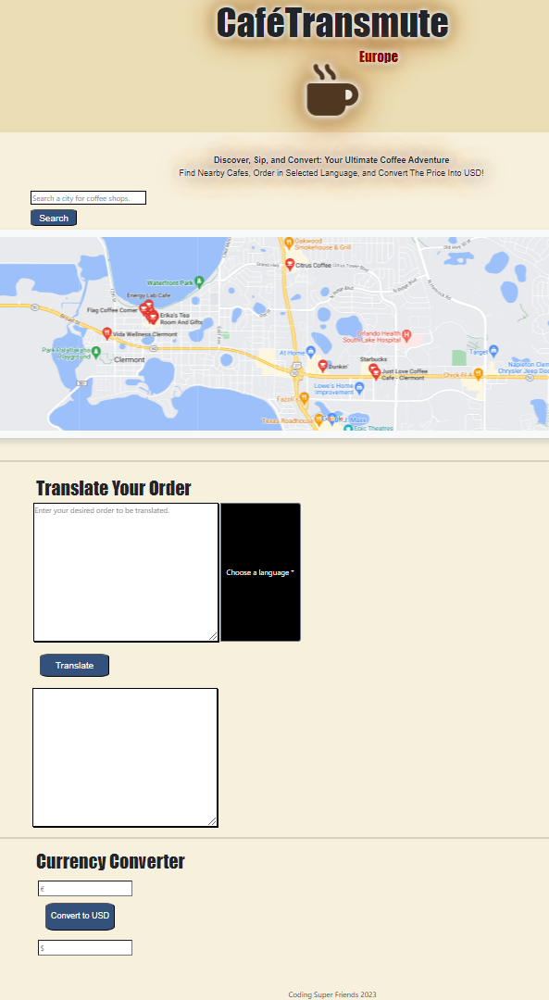

# CaféTransmute

## User Story 
AS a traveler I WANT to be able to locate a nearby coffee shop, place my order in the native language, and convert the price to USD SO THAT I can stay on budget and emerge in local culture 

## Description
The target audience for this app are English speakers traveling Europe in need of their daily coffee. Users will be able to locate nearby cafes based on their current location, translate their coffee order from English to the native language of the country they are in, and input the price they paid in Euro to convert to USD to ensure they are staying on budget.

## Technologies Used

- Maps Embed API
- Libretranslate API
- Free currency rates API
- Bootstrap
- JQuery
- Font Awesome

## How to Use

This application seeks permission to access your location in order to discover nearby coffee shops. It offers the functionality to enter your coffee order, which will be translated into the local language and saved for future reference. Additionally, the app performs currency conversion, converting the order cost from euros to USD for your convenience.

## Future Development

- Future development plans include upgrading the APIs to a more consistent and reliable source. Also will have added features such as navigation to the coffee shop within the app itself to avoid the user leaving the app to navigate to the store.

- Add all the languages in the European Union to the page.
- Creating versions for other countries.
- Text to speech
- versions for other countries

Projected cost: 
Libretranslate $29/mo
Domain $12/yr
Hosting $20/mo
Google Maps $7 per 1,000 hits

## Authors

    * Kevin Brackin  |  Github : kbrackin
    * Gaviel Castro  |  Github:  gavielskee
    * Andrea Kerazies|  Github : akcodes29
    * John Simeoni   |  Github : JeehawdJack
    * Sean Worrell   |  Github : shutterspeed1000
    
## License

N/A

## Deployed Application

https://akcodes29.github.io/CafeTransmute/

## Screenshot 

